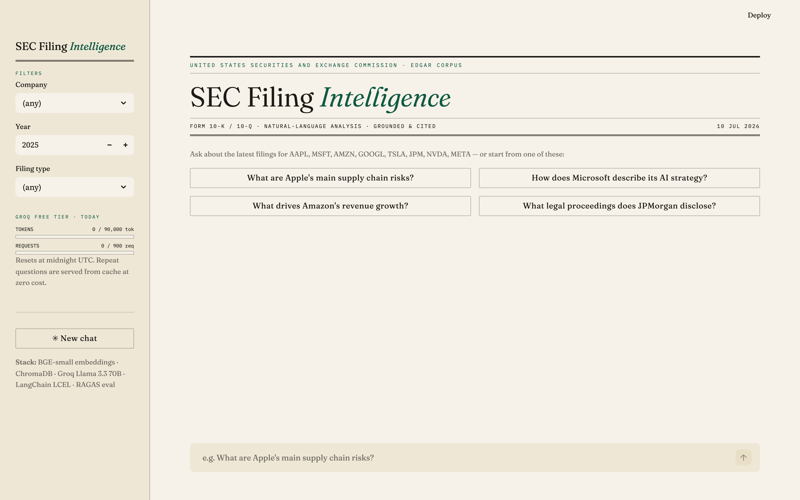
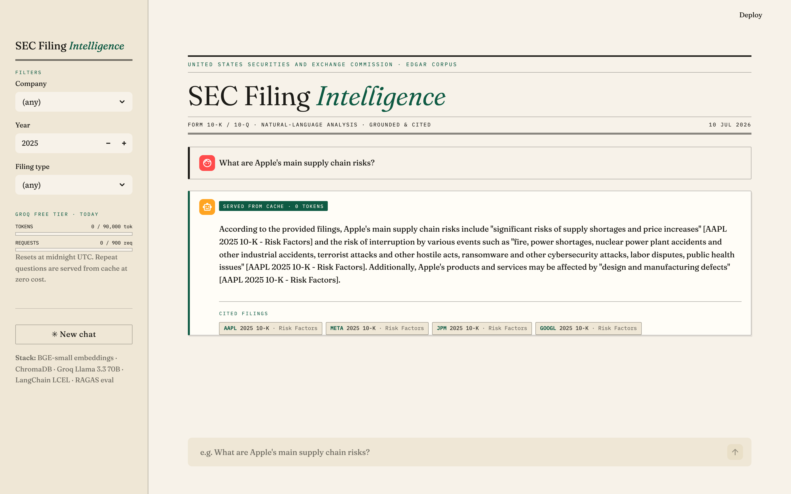

# SEC Filing Intelligence (sec-rag-intel)

> Production-grade RAG system that lets analysts query 10-K / 10-Q SEC filings in
> natural language and receive grounded, cited answers.

[](#deployment)




*A grounded, cited answer — served from the answer cache at zero token cost, with the
free-tier budget meter live in the sidebar:*



---

## What it does
Ask things like:
- *"What are Apple's main supply-chain risk factors in their latest 10-K?"*
- *"Compare R&D spend between Microsoft and Alphabet."*
- *"Which companies in the dataset call out generative AI as a material risk?"*

Every answer is **strictly grounded in the filings** and returned with citations like
`[AAPL 2024 10-K — Risk Factors]`. Hallucinations are caught quantitatively via
RAGAS faithfulness scores.

## Architecture
```
SEC EDGAR ──► sec-edgar-downloader ──► HTML
                                        │
                              BeautifulSoup parser
                                        │
                          RecursiveCharacterTextSplitter
                              (512 tok, 50 overlap)
                                        │
                  Local BAAI/bge-small-en-v1.5
                  (sentence-transformers, no API key)
                                        │
                  ChromaDB (local) ◄──► Pinecone (prod)
                                        │
                       MMR retriever (k=5, fetch_k=20)
                              + metadata filters
                                        │
                          LangChain LCEL chain
                                        │
                       Groq llama-3.3-70b-versatile
                                        │
                  Answer + Source attribution (JSON)
                          │              │
                       FastAPI       Streamlit UI
```

## Tech stack
| Layer | Tool |
|---|---|
| Data | SEC EDGAR (free) via `sec-edgar-downloader` |
| Parsing | BeautifulSoup (lxml) |
| Chunking | LangChain `RecursiveCharacterTextSplitter` |
| Embeddings | Local `BAAI/bge-small-en-v1.5` (sentence-transformers, zero API cost) |
| Vector store | ChromaDB (local) / Pinecone (prod) — toggled via `VECTOR_STORE_MODE` |
| Retrieval | MMR with metadata filters |
| LLM | Groq `llama-3.3-70b-versatile` |
| Orchestration | LangChain LCEL |
| Evaluation | RAGAS (`faithfulness`, `answer_relevancy`, `context_recall`) |
| API | FastAPI |
| UI | Streamlit |
| Deploy | HuggingFace Spaces |

## Quickstart

```bash
# 1. Setup
git clone <repo> sec-rag-intel && cd sec-rag-intel
python -m venv .venv && source .venv/bin/activate
make dev-install
cp .env.example .env             # then fill in GROQ_API_KEY (only key required for local dev)

# 2. Build the index (downloads filings → parses → embeds)
make index

# 3. Run it
make api      # FastAPI on http://localhost:8000
make ui       # Streamlit on http://localhost:8501

# 4. (optional) Evaluate
make eval     # writes eval_results/scores.json
```

## Free-tier guardrails (cost engineering)

The whole stack runs on free tiers, so Groq's daily quota (~100k tokens/day on
`llama-3.3-70b-versatile`) is treated as a production constraint, not an afterthought:

| Guardrail | Where | Effect |
|---|---|---|
| Daily token + request budget, persisted to disk | [src/chain/quota.py](src/chain/quota.py) | LLM calls stop *before* the tier is burned; resets midnight UTC |
| Requests-per-minute throttle | [src/chain/quota.py](src/chain/quota.py) | Stays under Groq's 30 req/min — no 429 storms |
| Answer cache keyed on question + filters + model | [src/chain/cache.py](src/chain/cache.py) | Repeat questions cost **0 tokens** (corpus is static, temperature 0) |
| `max_tokens` cap on every generation | [src/config.py](src/config.py) | No runaway answers |
| Graceful degradation | [src/chain/rag_chain.py](src/chain/rag_chain.py) | Budget spent → retrieval-only excerpts + citations instead of an error |
| Eval pre-flight check | [src/evaluation/evaluate.py](src/evaluation/evaluate.py) | Refuses a RAGAS run today's budget can't cover; suggests `make eval-subset N=…` |

Live usage is shown in the Streamlit sidebar (budget meter) and served at `GET /quota`.

## RAGAS evaluation scores
> Run `make eval` to populate. Scores are committed in `eval_results/scores.json`.

| Metric | Score | What it measures |
|---|---|---|
| `faithfulness` | _TBD_ | Are claims in the answer grounded in retrieved context? |
| `answer_relevancy` | _TBD_ | Does the answer actually address the question? |
| `context_recall` | _TBD_ | Did retrieval surface all the relevant context? |

## Add a new company
1. Add the ticker to `DEFAULT_TICKERS` in [src/ingest/downloader.py](src/ingest/downloader.py).
2. `make index` — downloads, parses, chunks, embeds.
3. New ticker shows up automatically in `/companies` and the Streamlit dropdown.

## Project layout
```
src/
├── ingest/         downloader, parser, chunker
├── embeddings/     vector store factory (Chroma / Pinecone)
├── retrieval/      MMR retriever + metadata filters
├── chain/          LCEL RAG chain + prompts
├── evaluation/     RAGAS runner + golden Q&A dataset
└── api/            FastAPI endpoints
app/                Streamlit UI
scripts/            build_index.py
tests/              pytest unit + integration
```

## Design decisions (interview-ready)
- **MMR over plain similarity** — reduces redundancy when multiple chunks come from the same paragraph.
- **ChromaDB local + Pinecone prod** — zero infra for dev, demonstrates managed-cloud familiarity for interviewers.
- **RAGAS over manual eval** — reproducible, quantitative; faithfulness catches hallucinations critical for financial data.
- **Source attribution** — SEC filings are legal documents, analysts must verify. This is a compliance argument, not a UX one.
- **Groq over OpenAI for inference** — competitive quality at much lower latency/cost.
- **Local BGE embeddings instead of an OpenAI/Cohere API** — zero recurring cost, identical vectors across runs (reproducibility), and the whole pipeline depends on a single paid API (Groq). Tradeoff: ~3-5% lower MTEB scores than `text-embedding-3-small` — acceptable for plain-English SEC prose.
- **Groq Llama 3.3 70B as RAGAS judge** — keeps the project on a single LLM provider, but introduces a mild self-evaluation bias since the same model family generates *and* judges. Mitigation: faithfulness scores are spot-checked manually on a 5-question random sample.
- **Quota guard + answer cache instead of hoping the free tier holds** — API quotas are a real production constraint; budgeting, throttling, caching, and graceful degradation are the same patterns you'd use against a paid bill. The system stays up (retrieval-only mode) even when the LLM budget is spent.

## Deployment

Deploys to [HuggingFace Spaces](https://huggingface.co/spaces/prasannawarad/sec-rag-intel)
(Streamlit SDK) via GitHub Actions — the sync workflow activates once the `HF_TOKEN`
repo secret is set (step 4 below) and skips safely until then.
The hosted demo uses **Pinecone** as the vector store so the index persists across Space restarts.

### One-time setup

```bash
# 1. Get a free Pinecone account → create a serverless index named "sec-rag-intel"
#    (or let index_pinecone.py create it automatically)
#    Add PINECONE_API_KEY to your .env

# 2. Upload all chunks to Pinecone
make index-pinecone           # uses VECTOR_STORE_MODE=pinecone from .env

# 3. Get a HuggingFace account → create a Space named "sec-rag-intel" (Streamlit SDK)
#    In the Space settings → Secrets, add:
#      GROQ_API_KEY          = your Groq key
#      PINECONE_API_KEY      = your Pinecone key
#      VECTOR_STORE_MODE     = pinecone
#      PINECONE_INDEX_NAME   = sec-rag-intel

# 4. In your GitHub repo → Settings → Secrets → Actions, add:
#      HF_TOKEN              = your HuggingFace write token

# 5. Push to main — the GitHub Action (.github/workflows/hf_sync.yml) auto-deploys
git push origin main
```

After that, every push to `main` triggers an automatic sync to HuggingFace Spaces.

## License
MIT
